# README.md

</img>

#  **👨‍👨‍👧‍👦팀원 소개**

### Backend

박성우 [@uaio88](https://github.com/uaio88)

백태훈 [@whiteburnout](https://github.com/whiteburnout)

### Frontend

김영현 [@KimYH-KU](https://github.com/KimYH-KU)

신인섭 [@InSub-Shin](https://github.com/InSub-Shin)

최나현 [@feb4th](https://github.com/feb4th)

## 📑 프로젝트 소개

- **진행기간**: 2021.03.01 ~ 2021.04.09

- **웹사이트 이름**: SPOT(Support & Produce Out Trip)

- **목표**
  - 빅데이터 기반 추천 알고리즘을 통해 맛집을 추천
  - 위치 기반 관광지 조회
  - 맛집과 관광지를 선택하여 코스를 제작

## ⚙️ 개발환경

</img>

## 🕹️주요 기능

- 메인페이지
  - 추천 테마
  - 추천 SPOT(맛집)
    - 위시리스트를 통한 맛집 추천
    - 콜드스타트 랭킹 상위권 맛집 추천

- 맛집 상세보기
  - 위시리스트 추가/해제
  - 가게 정보
  - 리뷰 기능
  
- 관광지 상세보기
  - 위시리스트 추가/해제
    - 관광지 정보
    - 리뷰 기능
  
- 여행코스 제작
  - 위치기반 관광지 추천 및 추가
    - 위시리스트의 관광지, 맛집 추가

- 검색
  - 맛집 검색
  
- 마이페이지
  - 여행코스와 위시리스트 조회
  

## 🙈 페이지 소개

### 메인페이지

>빅데이터 기반 맛집추천

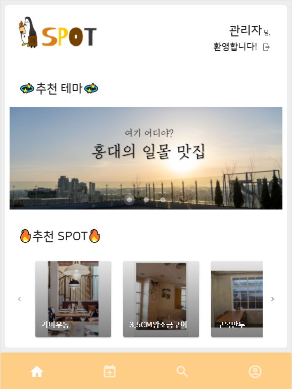</img>

### 맛집 상세페이지

>맛집 정보와 리뷰

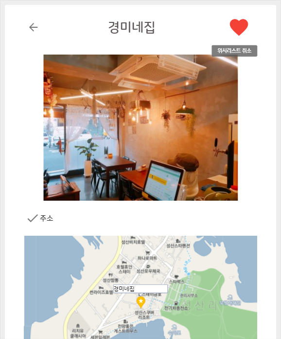</img>

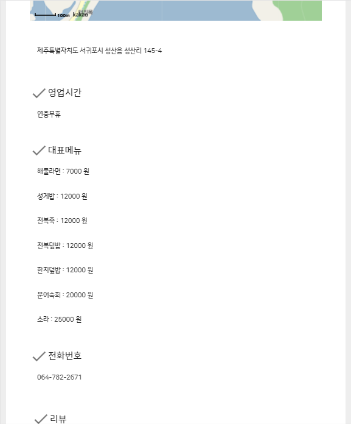</img>

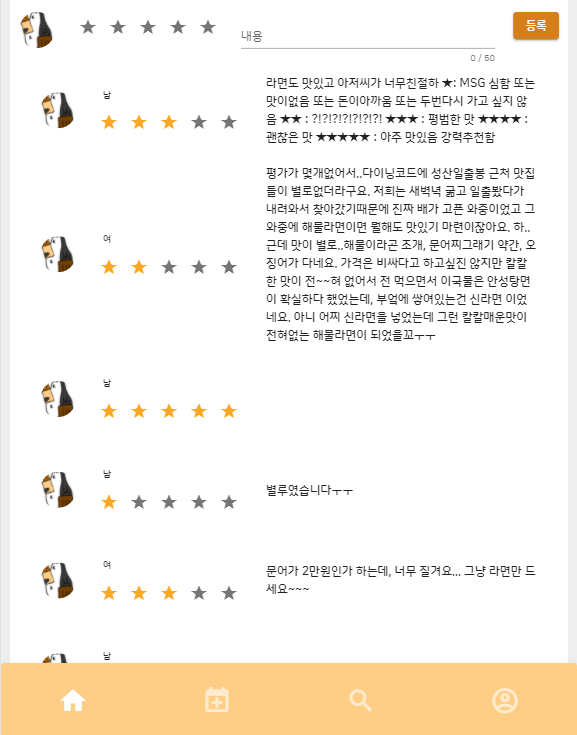</img>

### 관광지 상세페이지

>관광지 정보와 리뷰

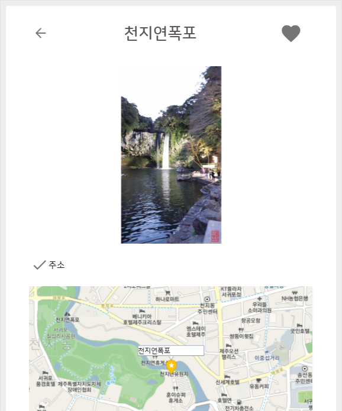</img>

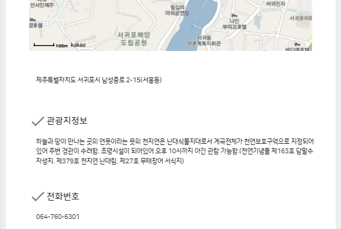</img>

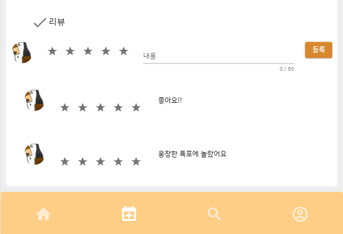</img>

### 여행코스 페이지

>코스 제작

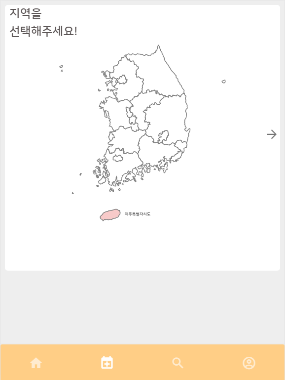</img>

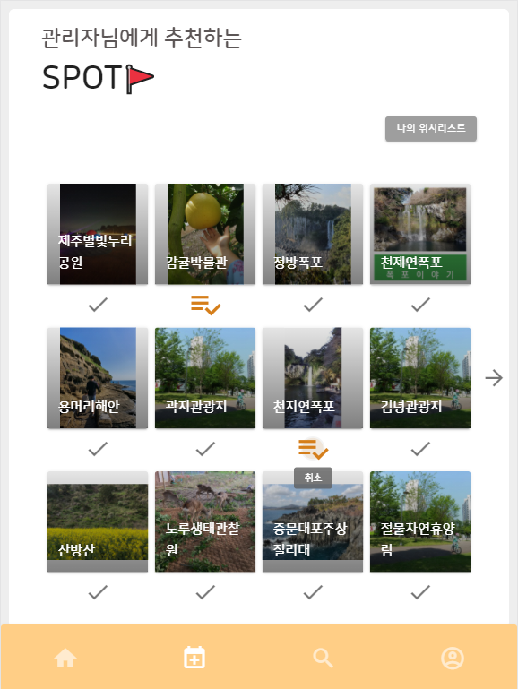</img>

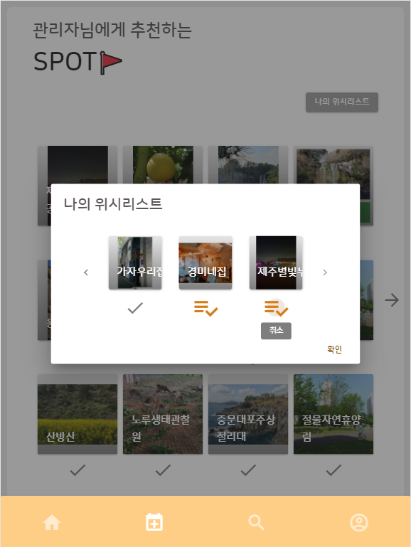</img>

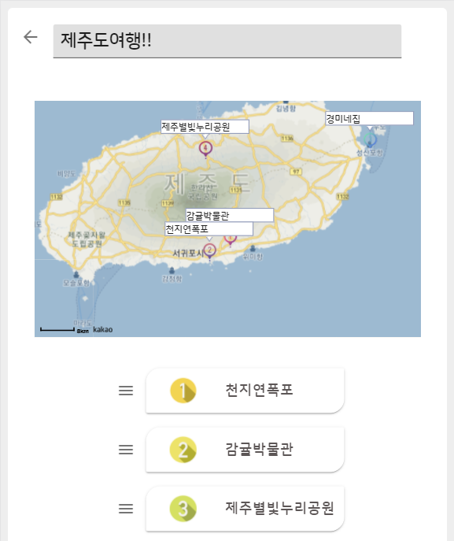</img>

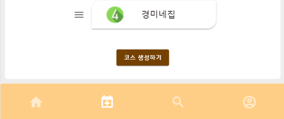</img>

### 마이 페이지

>여행 코스와 위시리스트

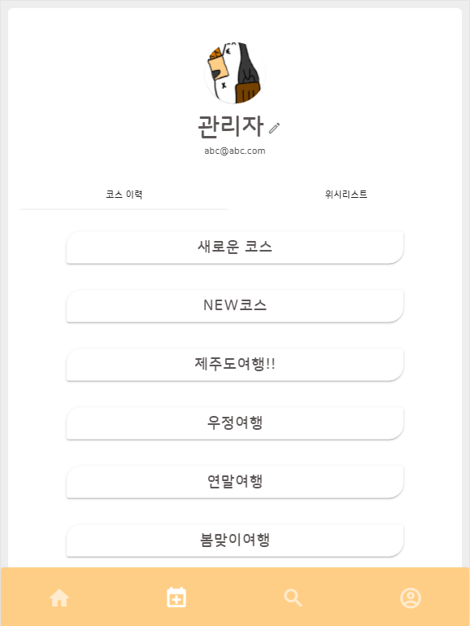</img>

### 검색 페이지

>맛집 검색

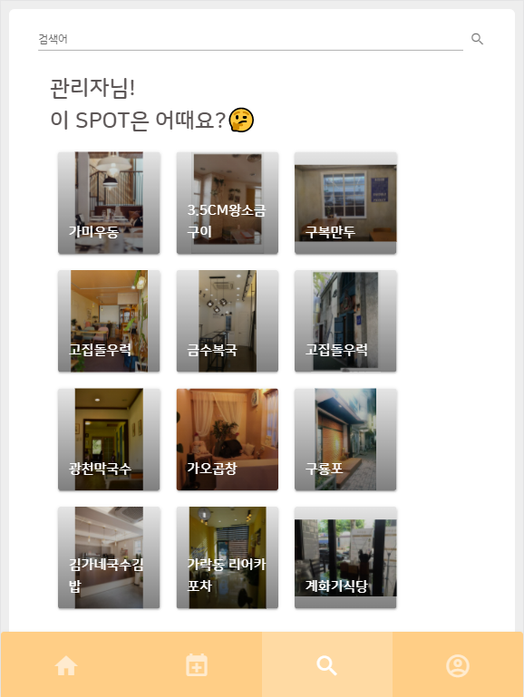</img>

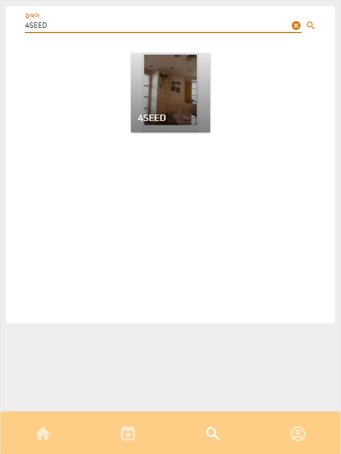</img>

