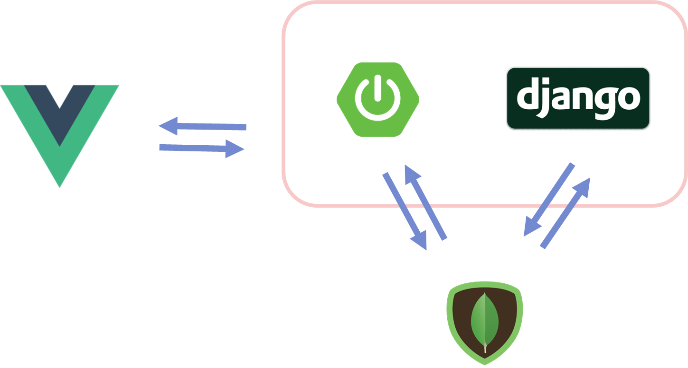

# README.md

</img>

# SPOT(Support & Produce Our Trip)

- **주제**

    : 빅데이터(맛집 정보, 관광지 등)를 활용하여 

      유저 기반으로 맛집과 관광지를 추천하고 여행 코스를 제작 할 수 있게 한다.

- **주요 기능**
    1. 유저 정보를 바탕으로 맛집을 추천
    2. 유저 위치 주변의 맛집 추천 및 관광지 조회
    3. 맛집과 관광지를 선택하여 여행 코스를 계획

- **사용할 데이터셋**
    1. SK BigData Hub
        - T Map 이용 데이터
    2. 공공데이터포털
        - 전국 관광지 정보 데이터
    3. SSAFY 제공
        - 맛집 데이터

# 개발도구

</img>

# 시스템 흐름

</img>